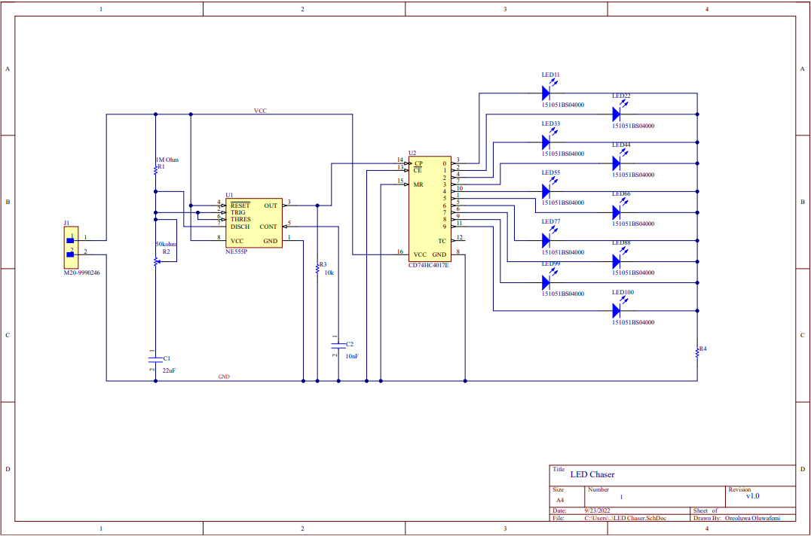
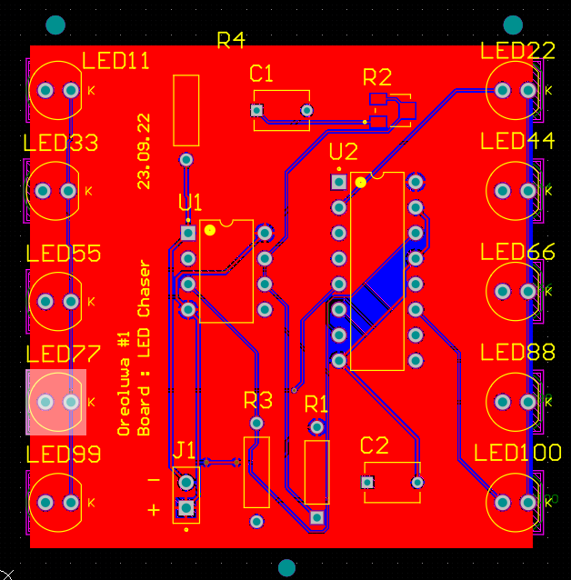

# LED-Chaser
LEDs turns on and off one after the other in a regular sequence.
This mini project was designed, tested and simulated on Altium Designer.
### Components 
LED x10, 
555 Timer,
Counter,
Male Header,
Resistor x3
Capacitor,
Potentiometer.

### Schematic 

### PCB
| 1 | 2| 
|--------------|-----------|
| | |
